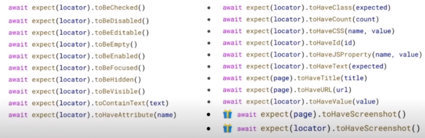

## 1: [Aprende Tests End to End con Playwright y Debbie O'Brien](https://www.youtube.com/watch?v=WlDkXteR8io)
- [Locators](https://playwright.dev/docs/locators)
  - Para encontrar elementos en la página
      - 

---
## 2: https://www.youtube.com/watch?v=x8wmQ-8oaMU
## 3: https://www.youtube.com/watch?v=K1hUFMxyWFg
## 4: https://www.youtube.com/watch?v=SL8NGMrITf8
## 5: https://www.youtube.com/watch?v=QE15jNA8zF0
## 6: https://www.youtube.com/watch?v=4_m3HsaNwOE&list=PLhW3qG5bs-L9sJKoT1LC5grGT77sfW0Z8
## 7: https://www.youtube.com/watch?v=BDh7123Lhmg&list=PLeo6Q1inqlOdzwuW6ivlX_95682PfsGGG&ab_channel=JulianMesa
## 8: https://www.youtube.com/watch?v=BDomHRQh7zU&ab_channel=midulive